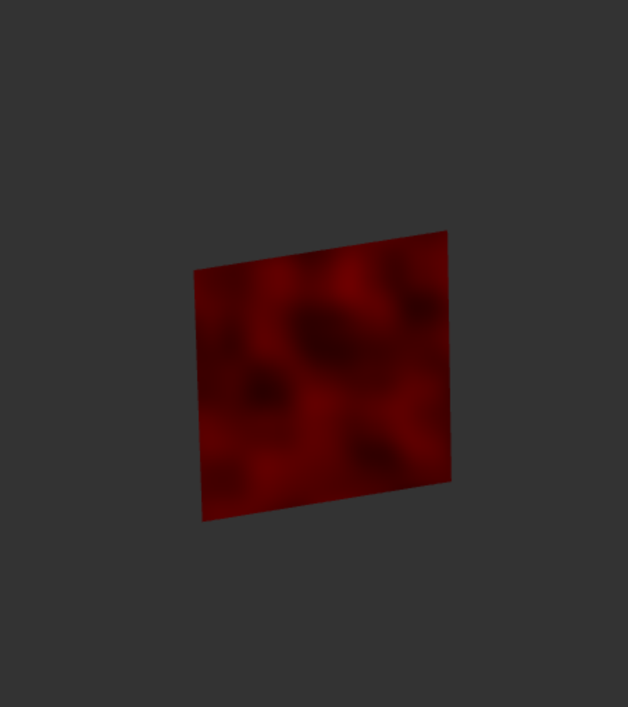
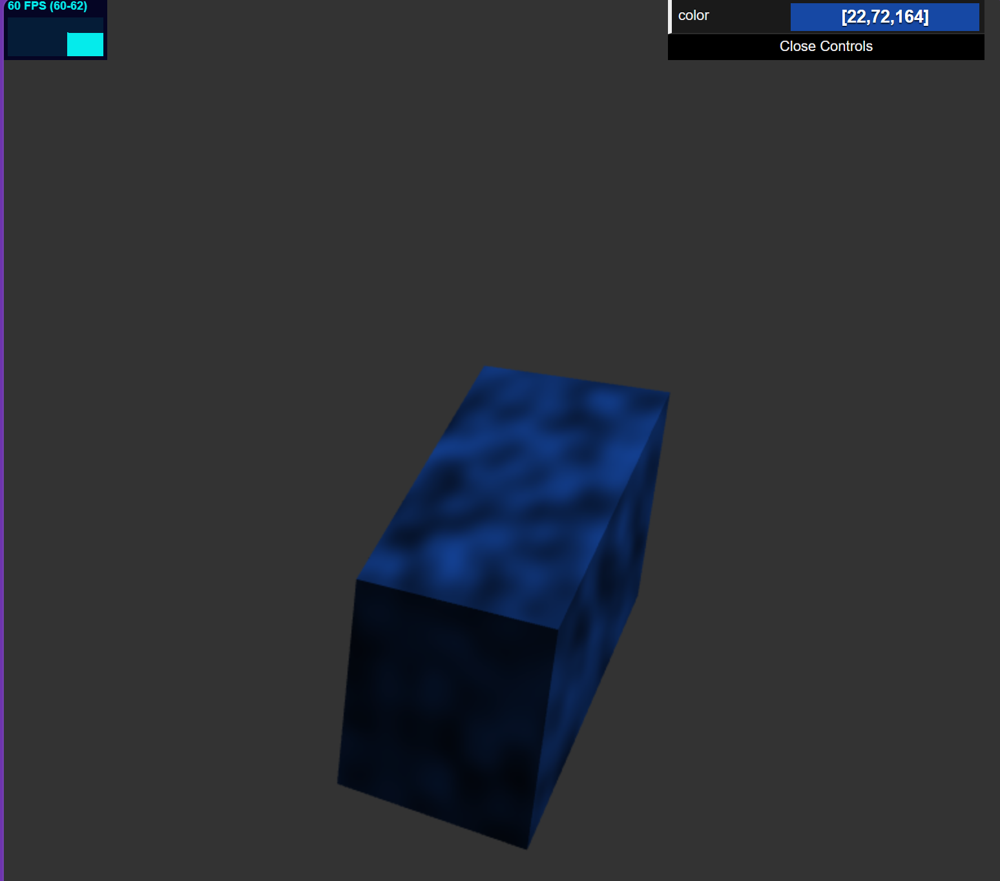

# HW 0: Intro to Javascript and WebGL

* Jacob Mollot

### Process
* I decided to go into depth when writing the Cube class. 
I wanted to experiment with trying to make the cube generation as procedural as possible with few hard coded values.
The for loop might be a little overly-condensced due to this, but the entire process really
re-familiarized me with the openGL pipeline, indexing logic, and matrix*vector multiplication in the context of CG.

* I also dug into a lot of documentation and referenced the base code frequently, as I wanted to try going that route 
rather than asking Ai immediately for things like function definitions and syntax.

* For the frag shader I added a simple 3D perlin noise.

* For the vertex shader I made the -x side of the cube bob
in an inverse relationship to how the +x side moved.

### Live Link:
https://jamollo.github.io/JMOLLOT_hw00-intro-base/

### Images

